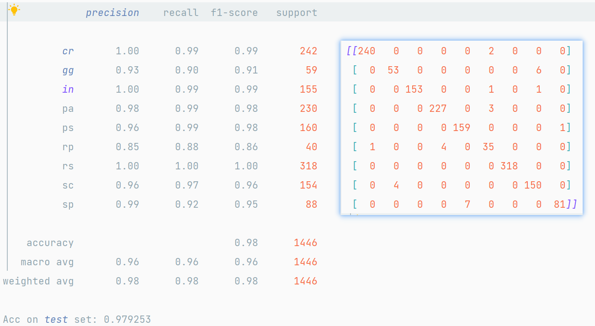
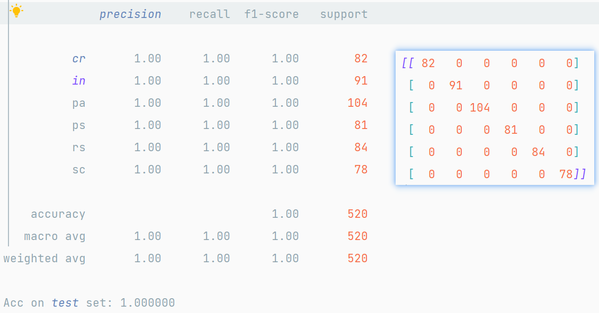
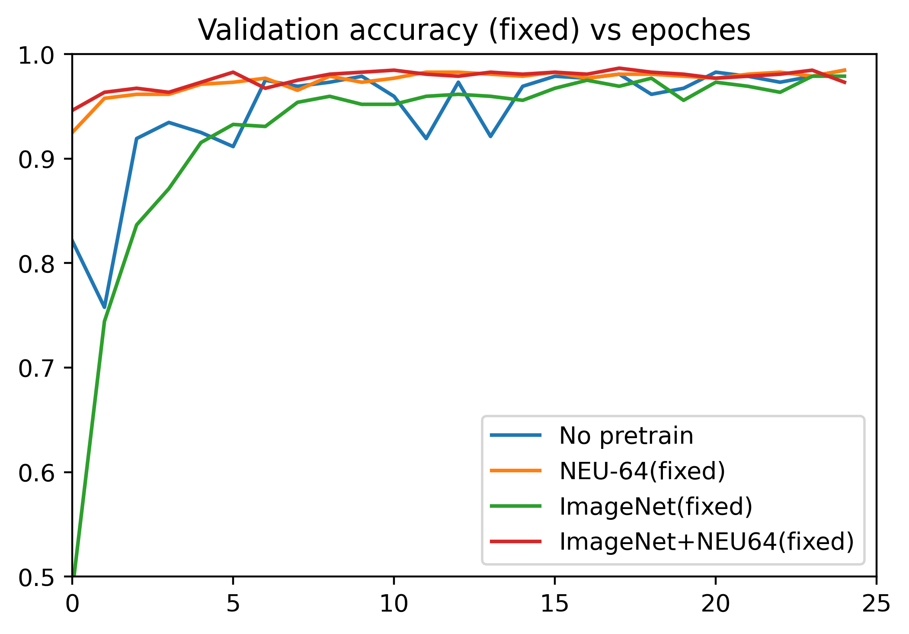
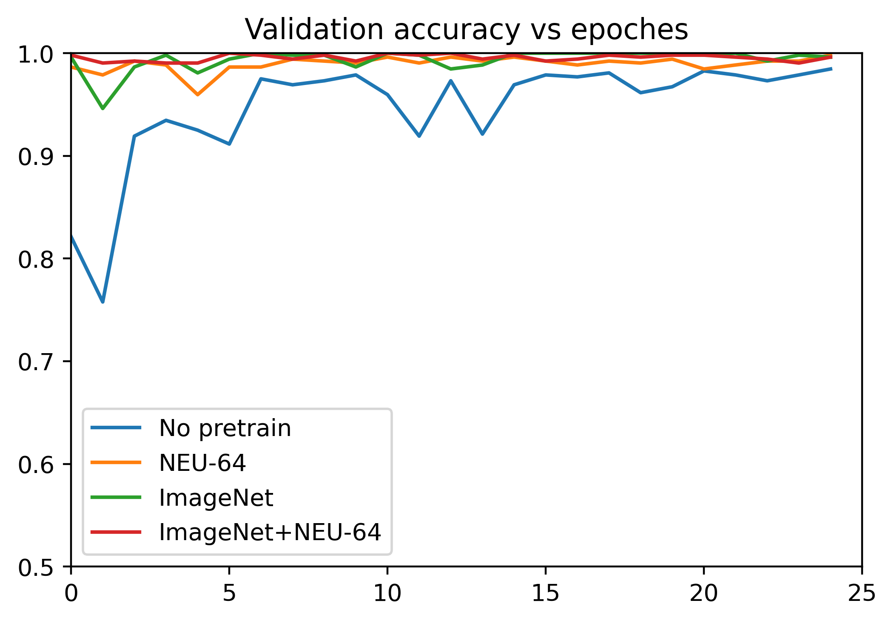

# ResNet-NEU-CLS
NEU Surface defect classification with ResNet.

## Dataset
[NEU surface defect database](http://faculty.neu.edu.cn/yunhyan/NEU_surface_defect_database.html)

> The official website is no longer accessible, please check [this repository](https://github.com/abin24/Surface-Inspection-defect-detection-dataset) for data.


|          | Dataset     | Classes | Image Size | Total Images         | Train |  Val  |
|----------|-------------|---------|------------|----------------------|-------|------|
| 数据集一 | NEU-CLS-64  | 9       | 64 * 64    |   6501                 | 5055  | 1446 | 
| 数据集二 | NEU-CLS-200 | 6       | 200 * 200  |   1800 (300/class) | 1280  | 520  |

## Files

- `data_preprocessing.py`: split and reorganize dataset
- `trainer.py`: functions for train
- `train.py`: main train code
- `eval.py`: main eval code
- `utils.py`: some useful functions

## Usage

修改并运行 `eval_data1.sh` 和 `eval_data2.sh` 对数据集一、二测试，即可得到如上结果。

默认对数据集目录 `data_dir` 中的 `val` 测试集进行测试，文件组织采用 `ImageNet` 的规范。
  
保存的 model 命名规范：`[Backbone]_[Pretrain]_[Pretrain]_[Dataset]_[fixed].pth`
> 如 `resnet18_ImageNet_NEU-64_NEU-200_fixed.pth` 表示主干网络为resnet18，用ImageNet预训练的参数在数据集一（NEU-64）上训练，再迁移到`NEU-200`数据集上训练，并且用冻结卷积迁移策略。


### Train

```sh
python train.py
```

### Eval

#### 数据集一：`NEU-CLS-64`

```sh
bash ./eval_NEU-64.sh
```

#### 数据集二：`NEU-CLS-200`
```sh
bash ./eval_NEU-200.sh
```

## Implement Details

### Data Augmentation
```python
transforms.RandomResizedCrop(size=input_size, scale=(0.7, 1.0)),
transforms.RandomHorizontalFlip(),
transforms.RandomVerticalFlip(),
transforms.RandomRotation(degrees=10)
```
alter `reszie` on `NEU-CLS-64`, with 25 epochs training, got:

|          |        |        |        |        |        |
|----------|--------|--------|--------|--------|--------|
| Resize   | 0.05   | 0.3    | 0.5    | 0.7    | 0.8    |
| Accuracy | 0.9606 | 0.9647 | 0.9706 | 0.9744 | 0.9723 |

> 结论：在一定范围里，变换越少，模型准确度越高，但泛化能力越差。

### Training
**All** hyper parameters and experiment settings are the **same** for **all** the models, except the `pretrain model` and `num_classes`:

```python
batch_size = 8
learning_rate = 0.0001
num_epochs = 25
optimizer = AdamW
num_classes = 6 or 9
```
### Transfer Learning
对所有输入进行`resize`处理，使得模型输入的图片均为`224 * 224`大小。迁移方式为直接替换分类器（FNN）部分，有如下两种训练策略：

1. Feature Extraction（fixed）：冻结卷积层参数，用作特征提取，只训练分类器；
2. Fine Tuning：不冻结任何网络层，训练全部模型参数。


## Result
We fixed the random seed and trained on a single `Tesla T4 GPU`, the results are as follows:
### Dataset 1: `NEU-64`

| Pretrain | NEU-64 Acc |
|----------|------------|
| -        | 0.9744   |
| ImageNet | 0.9793   |



### Dataset 2: `NEU-200`

| Pretrain                 | NEU-200 Acc | Time     |
|--------------------------|-------------|----------|
| -                        | 0.9846      | 3min 14s |
| NEU-64                   | 0.9981      | 3min 14s |
| ImageNet                 | 1.0000      | 3min 16s |
| ImageNet + NEU-64        | 1.0000      | 3min 14s |
| NEU-64 (Fixed)            | 0.9846      | 1min 20s |
| ImageNet (Fixed)          | 0.9788      | 1min 21s |
| ImageNet + NEU-64 (Fixed) | 0.9865      | 1min 21s |

- Fixed convolutional layer as `Feature Extraction` achieving a `2-3×` speedup with a slight reduction of `1%-2%` in accuracy.
- Transfer learning greatly accelerates model, only needs a few epochs of finetune.






## Conclusion
1. 对多种网络架构预实验，并快速迭代出最好的模型
2. 设计并实验了两种迁移策略（Feature Extraction 和 Fine-Tune）
3. 实验并分析对比了不同预训练模型（ImageNet、NEU-64、Hybrid）和迁移策略结果
4. 设计了带权重的交叉熵函数缓解数据不平衡问题，使模型性能有所提升
5. 实验多种数据增强策略，在两个数据集上均取得约1%性能提升


## Future Works
- 设计卷积层参数共享结构，进行多种相似数据集协同训练
- 更进一步，设计统一模型对两个数据集进行训练
- 少样本/零样本学习探索
